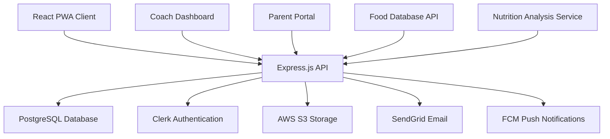

# Project Planning Document - Junior Football Nutrition Tracker

## Executive Summary

**Project Name**: Junior Football Nutrition Tracker  
**Project Type**: Mobile-First Web Application  
**Duration**: 8-10 weeks  
**Target Users**: Junior football players (ages 6-18), coaches, and parents  
**Primary Goal**: Improve young athletes' performance through better nutrition tracking and education

**Core Value Proposition**: A comprehensive, gamified nutrition tracking platform that helps junior football players optimize their performance through better eating habits while providing coaches and parents with insights and tools to support young athletes.

## Project Goals

### Primary Objectives
1. **Performance Improvement**: Enable 75% of users to show measurable performance improvements through better nutrition
2. **Behavior Change**: Achieve 60% adoption of recommended nutrition habits among users
3. **Educational Impact**: Increase nutrition knowledge scores by 30% among young athletes
4. **Team Engagement**: Facilitate 90% team member participation in nutrition tracking

### Secondary Objectives
1. **Family Involvement**: Engage 50% of parents/guardians in supporting their child's nutrition journey
2. **Coach Efficiency**: Reduce coach time spent on individual nutrition counseling by 40%
3. **Data-Driven Insights**: Provide actionable nutrition recommendations to 80% of active users
4. **Platform Adoption**: Achieve 70% monthly active user retention

## Technical Architecture

### Technology Stack

#### Frontend
```typescript
// Core Technologies
- Framework: React 18 with TypeScript
- State Management: Zustand for global state
- Routing: React Router v6
- UI Components: Tailwind CSS + Headless UI
- Forms: React Hook Form with Zod validation
- Data Fetching: TanStack Query (React Query)
- PWA: Workbox for service workers
- Testing: Vitest + React Testing Library
```

#### Backend
```typescript
// API & Database
- Runtime: Node.js with Express.js
- Language: TypeScript
- Database: PostgreSQL 14+
- ORM: Prisma
- Authentication: Clerk
- File Storage: AWS S3 or Cloudinary
- Email: SendGrid
- Push Notifications: Firebase Cloud Messaging
```

#### Infrastructure
```yaml
# Deployment & DevOps
Development:
  - Database: Local PostgreSQL
  - Client: Vite dev server
  - Server: Express with nodemon

Production:
  - Frontend: Vercel or Netlify
  - Backend: Railway or Heroku
  - Database: Supabase or Neon
  - CDN: Cloudflare
  - Monitoring: Sentry + LogRocket
```

### System Architecture



### Database Design

#### Core Entities
```sql
-- User Management
users (id, email, name, age, position, team_id, role, preferences)
teams (id, name, team_code, coach_id, settings)

-- Nutrition Tracking
food_entries (id, user_id, meal_type, timestamp, foods, totals)
food_database (id, name, brand, nutrition_per_100g, serving_sizes)

-- Performance Tracking
daily_metrics (id, user_id, date, energy, sleep, mood, hydration)
goals (id, user_id, type, target, current, deadline)

-- Gamification
achievements (id, name, description, criteria, points)
user_achievements (user_id, achievement_id, earned_at)
```

## User Research & Requirements

### Primary User Personas

#### 1. Young Football Player (Primary User)
**Demographics**: 
- Age: 8-16 years old
- Tech Comfort: High (mobile native)
- Football Experience: 2-8 years
- Nutrition Knowledge: Beginner to intermediate

**Needs & Pain Points**:
- Simple, fast food logging
- Visual and gamified experience
- Peer interaction and comparison
- Immediate feedback and rewards
- Educational content in digestible formats

**User Journey**:
```typescript
interface PlayerJourney {
  onboarding: {
    duration: "5-10 minutes",
    steps: ["profile setup", "team joining", "goal setting", "app tour"],
    successCriteria: "Complete first food entry"
  },
  dailyUsage: {
    duration: "3-5 minutes per session",
    frequency: "3-4 times per day",
    primaryActions: ["log meals", "check progress", "view achievements"]
  },
  weeklyEngagement: {
    activities: ["review progress", "complete challenges", "interact with team"],
    coachInteraction: "receive feedback and tips"
  }
}
```

#### 2. Football Coach (Secondary User)
**Demographics**:
- Age: 25-55 years old
- Team Size: 15-25 players
- Tech Comfort: Medium to high
- Nutrition Background: Basic to intermediate

**Needs & Pain Points**:
- Efficient team overview and monitoring
- Automated alerts for concerning patterns
- Simple communication tools
- Progress tracking across multiple players
- Educational resources to share

**Coach Workflow**:
```typescript
interface CoachWorkflow {
  weeklyReview: {
    timeInvestment: "15-20 minutes",
    tasks: [
      "review team nutrition compliance",
      "identify players needing support",
      "send team communications",
      "plan nutrition education topics"
    ]
  },
  individualSupport: {
    frequency: "as needed",
    tools: ["player progress view", "direct messaging", "goal adjustment"]
  }
}
```

#### 3. Parent/Guardian (Supporting User)
**Demographics**:
- Primary meal planners and grocery shoppers
- Varying nutrition knowledge
- High investment in child's athletic success
- Busy schedules requiring efficient tools

**Parent Features**:
- Weekly progress summaries
- Shopping list generation
- Meal planning assistance
- Communication with coach
- Educational resources

### User Requirements Analysis

#### Functional Requirements
```typescript
interface FunctionalRequirements {
  authentication: {
    userRegistration: "email/password or social login",
    teamJoining: "unique team codes",
    roleManagement: "player/coach/parent roles",
    ageVerification: "COPPA compliance for under-13"
  },
  
  nutritionTracking: {
    foodLogging: ["photo capture", "search database", "voice input", "quick add"],
    mealTypes: ["breakfast", "lunch", "dinner", "snacks", "pre/post training"],
    nutritionCalculation: "automatic macro and micronutrient totals",
    goalTracking: "personalized daily nutrition targets"
  },
  
  performanceMonitoring: {
    dailyMetrics: ["energy level", "sleep quality", "mood", "hydration"],
    trainingData: ["intensity", "duration", "type"],
    progressVisualization: "charts and trends over time"
  },
  
  teamManagement: {
    coachDashboard: "team overview with individual player summaries",
    communication: "team messages and individual feedback",
    reporting: "automated progress reports",
    alerts: "notifications for concerning patterns"
  }
}
```

#### Non-Functional Requirements
```typescript
interface NonFunctionalRequirements {
  performance: {
    pageLoadTime: "< 2 seconds on 3G",
    imageUpload: "< 10 seconds processing",
    offlineCapability: "24 hours full functionality",
    apiResponseTime: "< 500ms average"
  },
  
  usability: {
    mobileFirst: "optimized for phone usage",
    accessibility: "WCAG 2.1 AA compliance",
    ageAppropriate: "UI suitable for 8+ year olds",
    intuitive: "< 5 minutes to complete first food entry"
  },
  
  security: {
    dataProtection: "GDPR compliant",
    childPrivacy: "COPPA compliant",
    authentication: "secure JWT with refresh tokens",
    dataEncryption: "at rest and in transit"
  },
  
  reliability: {
    uptime: "99.9% availability",
    dataBackup: "daily automated backups",
    errorRecovery: "graceful handling of network issues",
    crossPlatform: "consistent experience across devices"
  }
}
```

## Business Requirements

### Market Analysis
**Target Market Size**: 
- Junior football players in Finland: ~50,000
- Broader European market: ~2 million
- Youth sports nutrition app market: Growing at 15% annually

**Competitive Landscape**:
- **MyFitnessPal**: Too complex for children, not sport-specific
- **Cronometer**: Excellent tracking but not gamified or team-focused
- **Youth Sports Apps**: Exist but lack comprehensive nutrition focus

**Unique Value Propositions**:
1. **Age-Appropriate Design**: Specifically designed for young athletes
2. **Team Integration**: Built-in coach and team management features
3. **Gamification**: Achievement system to maintain engagement
4. **Educational Focus**: Learning integrated with tracking
5. **Nordic Market Focus**: Local foods and cultural preferences

### Revenue Model (Future Considerations)
```typescript
interface RevenueStrategy {
  freeTier: {
    features: ["basic food logging", "simple analytics", "team joining"],
    limitations: "5 team members max, basic reporting"
  },
  
  coachSubscription: {
    price: "€15/month",
    features: ["unlimited team size", "advanced analytics", "parent communication"],
    target: "youth football clubs and academies"
  },
  
  parentPremium: {
    price: "€5/month",
    features: ["meal planning", "shopping lists", "detailed progress reports"],
    target: "individual families"
  }
}
```

### Success Metrics & KPIs
```typescript
interface SuccessMetrics {
  userEngagement: {
    dailyActiveUsers: { target: "70%", measurement: "percentage of registered users" },
    sessionDuration: { target: "5-8 minutes", measurement: "average time per session" },
    featureAdoption: { target: "80%", measurement: "users who complete food logging" },
    retention: { target: "60% at 3 months", measurement: "monthly active users" }
  },
  
  healthOutcomes: {
    nutritionGoalAchievement: { target: "75%", measurement: "users meeting daily targets" },
    knowledgeImprovement: { target: "30% increase", measurement: "pre/post quiz scores" },
    behaviorChange: { target: "40% improvement", measurement: "healthy eating habits" }
  },
  
  businessMetrics: {
    teamAdoption: { target: "90%", measurement: "team members completing onboarding" },
    coachSatisfaction: { target: "4.5/5", measurement: "coach feedback scores" },
    parentEngagement: { target: "50%", measurement: "parents using parent features" }
  }
}
```

## Risk Assessment & Mitigation

### Technical Risks

| Risk | Probability | Impact | Mitigation Strategy |
|------|-------------|---------|-------------------|
| **Database Performance Issues** | Medium | High | Implement proper indexing, use database connection pooling, plan for read replicas |
| **Mobile Performance Problems** | Medium | High | Performance budgets, image optimization, code splitting, thorough mobile testing |
| **Authentication Security Vulnerabilities** | Low | High | Use established providers (Clerk), implement security best practices, regular audits |
| **Third-party Service Outages** | Medium | Medium | Implement fallback options, graceful degradation, service status monitoring |
| **Food Database Accuracy** | Medium | Medium | Multiple data sources, user verification system, regular data validation |

### Product Risks

| Risk | Probability | Impact | Mitigation Strategy |
|------|-------------|---------|-------------------|
| **Low User Adoption by Children** | Medium | High | Extensive user testing, gamification, peer feedback, simple onboarding |
| **Coach Resistance to Technology** | Medium | Medium | Coach training materials, simple interface design, clear value demonstration |
| **Parental Privacy Concerns** | Low | High | Transparent privacy policy, GDPR compliance, data control features |
| **Seasonal Usage Fluctuations** | High | Medium | Year-round engagement features, off-season challenges, educational content |

### Business Risks

| Risk | Probability | Impact | Mitigation Strategy |
|------|-------------|---------|-------------------|
| **Competition from Established Players** | Medium | Medium | Focus on unique value proposition, rapid feature development, strong user experience |
| **Regulatory Changes (Data Protection)** | Low | Medium | Legal consultation, compliance-first design, adaptable architecture |
| **Market Size Overestimation** | Medium | Medium | Gradual expansion, validate with pilot programs, alternative market segments |

## Project Timeline & Milestones

### Phase 1: Foundation (Weeks 1-2)
**Milestone**: Core Infrastructure Completed

```typescript
interface Phase1Deliverables {
  week1: [
    "project setup and repository structure",
    "database schema design and implementation",
    "authentication system setup",
    "basic API routing structure"
  ],
  week2: [
    "user registration and login flows",
    "basic food entry form",
    "database connection and ORM setup",
    "deployment pipeline configuration"
  ],
  successCriteria: {
    technical: "Users can register, login, and create basic food entries",
    testing: "Core functionality passes automated tests",
    deployment: "Application deployed to staging environment"
  }
}
```

### Phase 2: Core Features (Weeks 3-5)
**Milestone**: MVP Feature Complete

```typescript
interface Phase2Deliverables {
  week3: [
    "comprehensive food logging interface",
    "photo capture and upload functionality",
    "basic nutrition calculation engine",
    "daily performance metrics tracking"
  ],
  week4: [
    "coach dashboard and team management",
    "team creation and joining system",
    "basic analytics and progress visualization",
    "notification system implementation"
  ],
  week5: [
    "goal setting and achievement tracking",
    "mobile responsiveness optimization",
    "performance optimization and testing",
    "user experience refinements"
  ],
  successCriteria: {
    functional: "All core user journeys complete and tested",
    performance: "Application meets performance benchmarks",
    usability: "User testing shows high satisfaction scores"
  }
}
```

### Phase 3: Enhancement & Polish (Weeks 6-8)
**Milestone**: Production Ready

```typescript
interface Phase3Deliverables {
  week6: [
    "advanced analytics and insights",
    "gamification features implementation",
    "educational content integration",
    "parent portal development"
  ],
  week7: [
    "comprehensive testing and bug fixes",
    "accessibility compliance verification",
    "security audit and improvements",
    "performance optimization"
  ],
  week8: [
    "production deployment preparation",
    "user documentation and help system",
    "monitoring and alerting setup",
    "launch preparation and marketing materials"
  ],
  successCriteria: {
    quality: "All tests passing, no critical bugs",
    compliance: "GDPR and accessibility standards met",
    readiness: "Production environment fully configured"
  }
}
```

## Resource Requirements

### Development Team
```typescript
interface TeamStructure {
  lead: {
    role: "Full-Stack Developer/Tech Lead",
    responsibilities: ["architecture decisions", "complex feature development", "team coordination"],
    timeAllocation: "100% for 8 weeks"
  },
  
  frontend: {
    role: "Frontend Developer (Optional)",
    responsibilities: ["UI/UX implementation", "mobile optimization", "user testing"],
    timeAllocation: "50% for weeks 3-7"
  },
  
  consultant: {
    role: "Sports Nutrition Expert",
    responsibilities: ["content review", "feature validation", "educational materials"],
    timeAllocation: "10 hours total"
  }
}
```

### Technical Infrastructure
```typescript
interface InfrastructureCosts {
  development: {
    database: "Local PostgreSQL (free)",
    hosting: "Local development (free)",
    storage: "Local file system (free)",
    total: "€0/month"
  },
  
  production: {
    frontend: "Vercel Pro (€20/month)",
    backend: "Railway Pro (€20/month)",
    database: "Supabase Pro (€25/month)",
    storage: "AWS S3 (€10/month)",
    monitoring: "Sentry (€26/month)",
    email: "SendGrid (€15/month)",
    total: "€116/month"
  }
}
```

### External Services & Tools
- **Design**: Figma (€12/month)
- **Project Management**: Linear (€8/month)
- **Code Repository**: GitHub (free for public repos)
- **Testing**: Browserstack (€39/month for cross-browser testing)
- **Analytics**: Google Analytics (free)

## Quality Assurance Strategy

### Testing Approach
```typescript
interface TestingStrategy {
  unitTesting: {
    framework: "Vitest",
    coverage: "80% minimum",
    focus: ["utility functions", "business logic", "API endpoints"],
    automation: "Run on every commit"
  },
  
  integrationTesting: {
    framework: "Cypress",
    coverage: "All critical user paths",
    focus: ["user registration", "food logging", "team management"],
    automation: "Run on pull requests"
  },
  
  userTesting: {
    phases: ["Phase 1: coach feedback", "Phase 2: player usability", "Phase 3: parent validation"],
    methods: ["prototype testing", "task completion", "feedback sessions"],
    criteria: ["task completion rate > 90%", "satisfaction score > 4.0/5"]
  },
  
  performanceTesting: {
    tools: ["Lighthouse CI", "WebPageTest", "Artillery"],
    benchmarks: ["Load time < 2s", "LCP < 1.5s", "API response < 500ms"],
    testing: "Weekly performance regression tests"
  }
}
```

### Code Quality Standards
```typescript
interface QualityStandards {
  codeStyle: {
    linting: "ESLint with Airbnb config",
    formatting: "Prettier with standardized rules",
    typeChecking: "TypeScript strict mode enabled",
    preCommitHooks: "Husky + lint-staged"
  },
  
  codeReview: {
    process: "All changes require pull request review",
    checklist: ["functionality", "performance", "security", "accessibility"],
    automation: "Automated checks must pass before review",
    documentation: "Code changes include updated documentation"
  },
  
  security: {
    dependencies: "Regular dependency vulnerability scanning",
    authentication: "Secure token handling and storage",
    dataValidation: "Input validation on all user inputs",
    privacy: "GDPR compliance verification"
  }
}
```

## Success Measurement

### Launch Metrics (First 30 Days)
```typescript
interface LaunchMetrics {
  adoption: {
    userRegistrations: { target: 100, measurement: "total registered users" },
    teamSignups: { target: 5, measurement: "active teams using platform" },
    completedOnboarding: { target: "80%", measurement: "percentage completing setup" }
  },
  
  engagement: {
    dailyActiveUsers: { target: "40%", measurement: "percentage of registered users" },
    foodEntriesPerUser: { target: 15, measurement: "average entries in first month" },
    sessionDuration: { target: "4+ minutes", measurement: "average session length" }
  },
  
  quality: {
    bugReports: { target: "< 5 critical", measurement: "critical bugs reported" },
    userSatisfaction: { target: "4.0/5", measurement: "average user rating" },
    performanceScore: { target: "90+", measurement: "Lighthouse performance score" }
  }
}
```

### Long-term Success Indicators (3-6 Months)
```typescript
interface LongTermMetrics {
  userRetention: {
    monthly: { target: "60%", measurement: "users active in month 3" },
    engagement: { target: "70%", measurement: "users logging food 3+ times/week" },
    coachRetention: { target: "80%", measurement: "coaches active after 3 months" }
  },
  
  healthOutcomes: {
    goalAchievement: { target: "70%", measurement: "users meeting nutrition goals" },
    knowledgeGains: { target: "25%", measurement: "improvement in nutrition knowledge" },
    behaviorChange: { target: "50%", measurement: "reported improvements in eating habits" }
  },
  
  platformGrowth: {
    organicGrowth: { target: "30%", measurement: "new users from referrals" },
    teamExpansion: { target: "20 teams", measurement: "total active teams" },
    marketPresence: { target: "regional recognition", measurement: "mentions in youth sports media" }
  }
}
```

## Conclusion

This comprehensive planning document establishes the foundation for building a successful Junior Football Nutrition Tracker application. The project balances ambitious goals with realistic timelines, ensuring delivery of a high-quality product that serves the unique needs of young athletes, their coaches, and families.

**Key Success Factors:**
1. **User-Centric Design**: Deep understanding of young athlete needs and behaviors
2. **Technical Excellence**: Modern, scalable architecture with performance focus
3. **Iterative Development**: Rapid prototyping and user feedback integration
4. **Quality Assurance**: Comprehensive testing and monitoring strategies
5. **Market Focus**: Clear value proposition for Nordic youth football market

The 8-week development timeline provides sufficient time for thorough feature development, testing, and refinement while maintaining momentum toward launch. The phased approach ensures core functionality is delivered early, allowing for user feedback and iterative improvements throughout the development process.